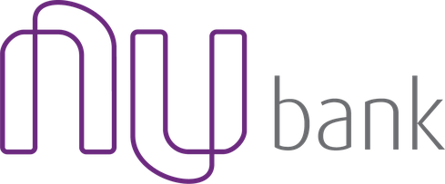

# Nubank Interface 

#### This is a study project only and has no involvement with the Nubank brand. :books:

### :electric_plug: Requeriments

- Node.JS >= 10.16.2
- Yarn >= 1.17.3
- NPM >= 6.9.0

### :camera: <a href="http://linkedin.com/in/leonardoalmeida99">Click here to see the project video presentation</a>

### Getting started

<a href="http://linkedin.com/in/leonardoalmeida99">Connect me in LinkedIn</a> | <a href="http://behance.net/almeida99">See my Behance</a> | <a href="https://leunardo.dev">Click here to go to my CV</a>

